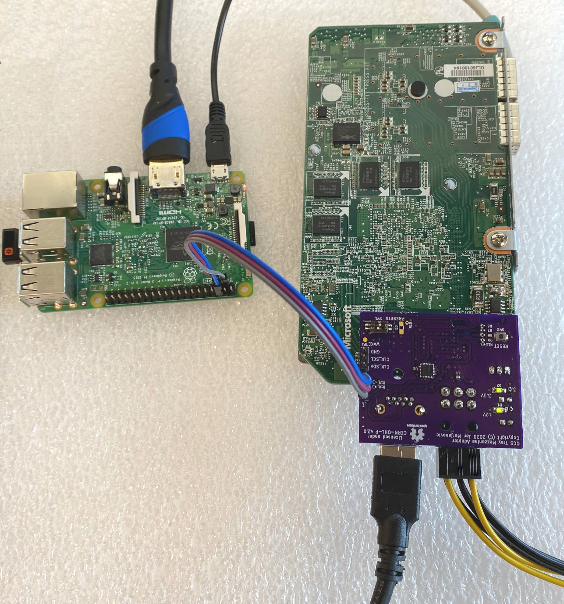

# OCS Tray Mezzanine Adapter, version 1

## The adapter in action

Here we can see the adapter board connecting the PCIe (x1, over USB) to the FPGA
board, 12V power from the ATX power supply, and I2C to the Raspberry Pi.

## revA

[Schematics as PDF](production/revA/ocp-tray-mezzanine-adapter-v1-revA.pdf)

Known limitations/errors:

  * Samtec connector is rotated by 180 deg - the keying pins on the sides need
    to be trimmed
  * Pin 4 on the USB should be not be connected to the board; it should either
    be trimmed before soldering or the via should be removed
  * The mounting hole is slightly misaligned

## TODO for revB

  * solder mask keep-out for PCIe lanes 7, 8 and 15
  * solder mask keep-out for layer indicators
  * move label R2 (silkscreen over pad)
  * (optional) labels for SDA, SCL and GND on MEZZ I2C connector
  * mode capacitors C1 and C5 to the other side (shorter traces)
  * pin 1 and 4 on the USB connector carry the PCIe signals, fix the connections
  * the LED for the mezzanine present signals has wrong polarity, it should be
    powered from 3V3
  * fix the orientation of the Samtec connector
  * fix the alignment of the mounting hole
